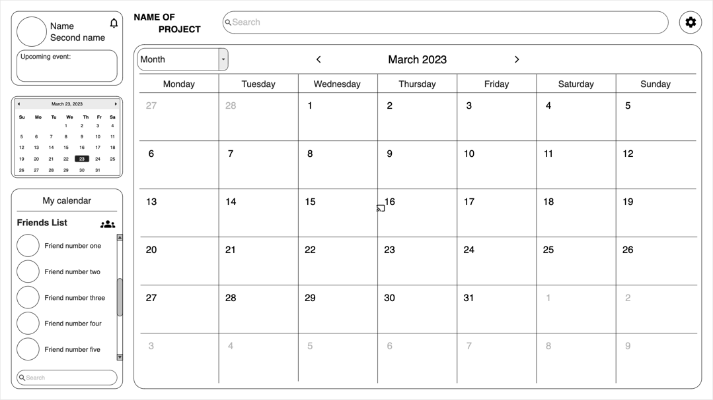

## Цель
Целью нашего проекта было желание упростить процесс встречи между двумя людьми,
так как современный темп жизни настолько быстр, что очные встречи становятся все более редкими.
Так же мы хотели переосмыслить современный календарь и добавить в него что-то новое.

Мы разработали календарь, который, считывая личное расписание двух или более людей, может составить обобщенный календарь.
В нем будет отображаться информация о занятом и свободном времени: 
серым отмечено время занятое хотя бы у одного человека из участников, 
а зеленым свободное для всех участников время.

##  Target
The goal of our project was to simplify the process of meeting between two people,
since today's pace of life is so fast that face-to-face meetings are becoming increasingly rare.
We also wanted to rethink the modern calendar and add something new to it.

We developed a calendar that, by reading the personal schedules of two or more people, can make a generalized calendar.
It will display information about busy and free time, with the gray showing busy time for at least one person among the participants,
and the green showing free time for all participants.

## Layout / Макет

## Available Scripts

In the project directory, you can run:

### `npm start`

Runs the app in the development mode.\
Open [http://localhost:3000](http://localhost:3000) to view it in your browser.

The page will reload when you make changes.\
You may also see any lint errors in the console.

### `npm test`

Launches the test runner in the interactive watch mode.\
See the section about [running tests](https://facebook.github.io/create-react-app/docs/running-tests) for more information.

### `npm run build`

Builds the app for production to the `build` folder.\
It correctly bundles React in production mode and optimizes the build for the best performance.

The build is minified and the filenames include the hashes.\
Your app is ready to be deployed!

See the section about [deployment](https://facebook.github.io/create-react-app/docs/deployment) for more information.

### `npm run eject`

**Note: this is a one-way operation. Once you `eject`, you can't go back!**

If you aren't satisfied with the build tool and configuration choices, you can `eject` at any time. This command will remove the single build dependency from your project.

Instead, it will copy all the configuration files and the transitive dependencies (webpack, Babel, ESLint, etc) right into your project so you have full control over them. All of the commands except `eject` will still work, but they will point to the copied scripts so you can tweak them. At this point you're on your own.

You don't have to ever use `eject`. The curated feature set is suitable for small and middle deployments, and you shouldn't feel obligated to use this feature. However we understand that this tool wouldn't be useful if you couldn't customize it when you are ready for it.
ё